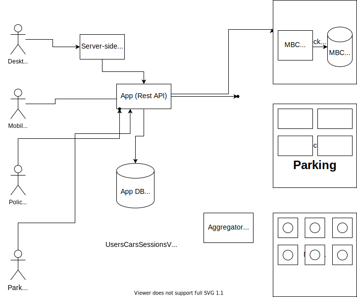

# eDriver Space

[](https://github.com/ASeegull/edriver-space/actions/workflows/lint.yml)
[](https://github.com/ASeegull/edriver-space/actions/workflows/unit-tests.yml)
[](https://goreportcard.com/report/ASeegull/edriver-space)
[](https://coveralls.io/github/ASeegull/edriver-space?branch=main)


### Recommended workspace layout

Please use [layered architecture](https://www.oreilly.com/library/view/software-architecture-patterns/9781491971437/ch01.html)
The main point is that layers should be isolated from one another and changes in one layer should affect this and possibly another associated layer.

```
├─ src (or however you'll name your root directory)
│   ├─ edriver-space (root of current repository)
│         ├─ docs
│         ├─ cmd
│             ├─ app/ main.go (<-- program entry point)
│         ├─ conf
│         ├─ handlers
│         ├─ migrations
│         ├─ model
│         ├─ strorage
│         ├─ parking
│         ├ docker-compose.yaml
│   ├─ edriver-space-webapp (root of [this](https://github.com/ASeegull/edriver-space-webapp) repository)
│   ├─ edriver-space-aggregator (root of [this](https://github.com/ASeegull/edriver-space-aggregator) repository)
```
